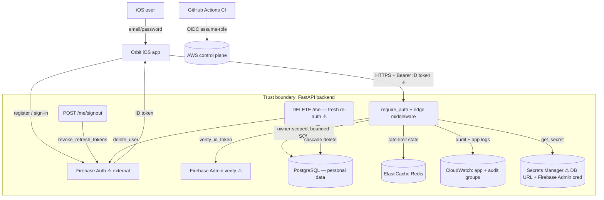

# Plan — Orbit greenfield (full depicted app)

## Summary

Build the **full depicted Orbit app end-to-end**: a native SwiftUI iOS client that
replicates the approved Claude Design export (`design/design_handoff_orbit_swiftui/`) as
faithfully as iOS allows, over a new Python 3.12 / FastAPI / PostgreSQL backend with
Firebase email/password auth, on an AWS deploy path with the CI merge gate already
scaffolded in `.github/workflows/`. The prototype is client-only ("No networking"); this
run designs the real backend behind it. The core approach is a **thin, owner-scoped REST
backend** (every domain row keyed by Firebase UID, every collection query day-/window-bounded
with a hard LIMIT, timestamps client-provided but future-rejected) fronted by an
`@Observable` shared store on the client that drives the cross-screen reactions the design
depicts. This shape was chosen over a GraphQL/aggregate-heavy API (unnecessary at skeleton
scale and harder to bound/rate-limit per resource) and over a client-only local-persistence
app (the brief explicitly requires "real persistence, real auth, deploy path"). **Visual
fidelity work — starfield and SceneKit 3D heroes — is staged as the LAST two tasks** so an
implementation cap lands after the app is functional end-to-end (design-audit §5). **Native
iOS is a reduced-assurance target**: the deterministic security/coverage gates analyze
little Swift, so the Swift portion is verified by XCTest/XCUITest/snapshot + human review and
is never claimed "gate-verified"; the backend carries full gate coverage.

This plan replicates a **human-approved design spec**, so the inherited visual/UX/layout/
component decisions are settled input — the *what/why/how* rationale below is applied to the
**translation, backend, and architecture** decisions and to each flagged web→native
adaptation, not to re-justifying the design itself (§ Frontend traces every `SCREEN-n`/`CMP-n`
to a plan section and an acceptance criterion).

## Stack notes

- **Backend language — Python 3.12 / FastAPI (default kept).** Endorsed: CLAUDE.md pins it,
  FastAPI gives a served OpenAPI schema for free (DAST-1), Pydantic v2 is the validation-contract
  mechanism, and structlog/Alembic/SQLAlchemy are first-class. No reason to deviate.
- **Frontend — native iOS SwiftUI (alternative to the JS default; ratified).** The design target
  is a native iOS app; recorded here per the "native iOS" alternative. Architecture = **MV +
  `@Observable`** (Apple's post-Observation guidance), *not* per-view MVVM (`swift-conventions`);
  chosen over TCA because the app has one shared cross-screen store, not many independent complex
  reducers — TCA's ceremony would not pay for itself here. **Deployment target iOS 17.0** (enables
  `@Observable`, `.scrollTargetBehavior`, `containerRelativeFrame`, `.sensoryFeedback`), Swift 6
  strict concurrency. **Reduced-assurance** for the deterministic gates — stated in Test strategy.
- **Database — PostgreSQL + Alembic + SQLAlchemy 2.0 async (`asyncpg` driver) (default kept).**
  Postgres over SQLite because the deploy path is a shared RDS instance with concurrent writers and
  real constraints (CHECK/FK/UNIQUE) the tests exercise; SQLite's weaker concurrency/constraint
  story would diverge from prod. `asyncpg` is the async DBAPI (ecosystem default; over `psycopg3`
  for maturity + speed on this simple query set). Alembic per CLAUDE.md.
- **Auth — Firebase Auth email/password (default kept), behind a `require_auth` facade.** Firebase
  is cloud-agnostic (Google-hosted, runs on AWS), owns password storage/KDF/breach policy so the
  backend never sees a raw password, and the backend only *verifies ID tokens*. Chosen over Cognito
  (AWS-single-vendor) because the design/brief already specify Firebase and DX is better; the
  one-vendor argument does not outweigh a settled brief. **MFA/social login are out of scope**
  (requirements) — flagged as an ASVS 6.3.3 waiver below, not a silent omission.
- **Cloud / IaC — AWS + Terraform, DATA-SECURITY BASELINE ONLY this run (depth decision — flag
  for checkpoint).** The brief says "AWS + Terraform *as/if the deploy path requires* (planning
  decides depth)." Decision: author `infra/` covering the **persistence + secrets + observability
  baseline** (RDS-encrypted, Secrets Manager, ElastiCache Redis for the rate-limit store,
  CloudWatch log groups with retention + delete-deny policy, S3/DynamoDB remote state,
  least-privilege security groups) so that SSE-at-rest, runtime-secrets, and log-immutability are
  **real and Checkov-scannable** rather than a stack of waivers. **Defer** the compute topology
  (App Runner/ECS service + ALB + autoscaling + the `envs/` staging/prod split + WAF/CloudFront +
  deploy alarms) and the actual `terraform apply` to the deployment stage (`deploy.yml` is inert
  until `DEPLOY_ENABLED=true`). Backend runs as a **direct process** this run (CLAUDE.md), reading
  secrets from Secrets Manager/SSM in deploy and from local env/Redis in dev, both behind the
  secrets facade. This is the honest middle path; surfaced for the human to confirm the depth.
- **Observability — structlog + OTel trace-IDs + CloudWatch (default kept); Sentry init thin this
  run.** Full SLO burn-rate alarms/synthetics/dSYM upload (`observability-conventions`) are a
  deploy-time concern deferred with the compute topology; this run ships the structured-log +
  trace-propagation foundation and a release-tagged Sentry init stub.
- **Rate-limit store — ElastiCache Redis behind a limiter facade.** `api-edge-conventions` forbids
  in-process counters (they fail open behind an LB). Redis is provisioned in `infra/` and the
  facade uses a local Redis in dev; chosen over in-proc so the limiter is correct when compute
  scales, even though this run runs single-process.
- **Dependencies — exact-pinned with the cooldown rule (implementation commitment).** Every
  third-party package (Python + SPM + the Terraform AWS provider) is **exact-pinned** in
  `pyproject.toml`/lockfile / `Package.swift` / `required_providers`, choosing a stable release
  **≥14 days old** (cooldown) and honoring the `n-1` obsolescence rule per `dependency-audit-policy`
  — never a blind "latest". Plan-audit reality-checked the named packages (all real, permissively
  licensed); `swift-snapshot-testing` (SPM) and `hashicorp/aws` must be hand-verified against the
  canonical source URL at pin time (typosquat guard).

## Data / migrations

**Store:** PostgreSQL. **Migrations + seeds:** Alembic (`migrations/`). **Repository layer:**
SQLAlchemy 2.0 async models (`asyncpg` driver) + a repository facade per aggregate
(`src/orbit/repositories/`), so every query is owner-scoped and bounded in one place (the
row-level-ownership + LIMIT invariants live at this seam, not scattered across routes — this is what
makes the IDOR and bounded-query acceptance criteria mechanically true).

**Ownership + PII stance (CLAUDE.md):** every domain row carries `owner_uid` (Firebase UID);
**no local PII beyond the UID** — email/display name/avatar stay in Firebase (the greeting/avatar
read the Firebase profile client-side). The UID is an opaque account identifier, not stored PII.

**Day-keyed model:** domain rows carry `day_key` = the user's **device-timezone local date**
(`YYYY-MM-DD`); the client sends `day_key` (and `tz` where a rollover decision is needed).
Timestamps (`logged_at`/`done_at`) are client-provided full instants; **backdating allowed,
future (> server now + small skew) rejected 422** (requirements). *(Open item default adopted:
day-key = device-tz local date — confirm at checkpoint.)*

**Weight:** stored **canonical metric (kg)**; display converts per the units setting (round 0.1)
on the client.

### Schema (tables + why)

| Table | Key cols | Ownership | Notes / bound |
|---|---|---|---|
| `profiles` | `owner_uid` PK; `kcal_budget`, `protein_target_g`, `carb_target_g`, `fat_target_g`, `score_base`(512), `tier_label`, `percentile_label`, `next_tier_pct`, `palette_preset`, `units`, `gender`, `planet_index`, `burned_kcal`(nullable→0), `burn_rate`(nullable), `created_at` | per-user | one row/user; seeded defaults on bootstrap |
| `muscle_base_levels` | `owner_uid`,`muscle_group`,`level`(1–6) | per-user | 13 rows/user; seeded to design defaults on bootstrap |
| `quick_foods` | `id` PK; `name`,`kcal`,`protein_g`,`carb_g`,`fat_g` | **global seed** | catalog; no owner |
| `food_entries` | `id` PK; `owner_uid`,`name`,`kcal`,`protein_g`,`carb_g`,`fat_g`,`meal_group`,`logged_at`,`day_key`,`created_at` | per-user | **≤ 200 rows / (uid, day_key)**, hard LIMIT on read |
| `programs` | `id` PK; `name`,`focus`,`est_minutes` | **global seed** | one seeded "Push Day" |
| `exercises` | `id` PK; `program_id`,`order_index`,`name`,`sets`,`reps`,`weight`,`muscle_tag` | **global seed** | 5 seeded exercises |
| `set_events` | `id` PK; `owner_uid`,`exercise_id`,`set_index`,`done_at`,`day_key`; **UNIQUE(owner_uid,exercise_id,set_index,day_key)** | per-user | toggle = create/delete; read scoped to (uid, day_key), LIMIT |
| `weight_entries` | `id` PK; `owner_uid`,`weight_kg`,`day_key`,`logged_at`,`created_at` | per-user | read = **30-day window**, hard LIMIT |

**Constraints (each is a test target — AC "constraint→4xx not 500"):** `CHECK kcal BETWEEN 0 AND
10000`, `CHECK macro grams BETWEEN 0 AND 2000`, `CHECK weight_kg BETWEEN 20 AND 500`, `CHECK level
BETWEEN 1 AND 6`, `CHECK set_index >= 0`, `CHECK planet_index BETWEEN 0 AND 5`, FK `food_entries`/
`set_events`→exercises/programs, the `set_events` UNIQUE above, `meal_group`/`units`/`gender`/
`palette_preset` enum CHECKs.

**Seeds (via a dedicated Alembic data migration, not app code):** quick-food catalog (with macros),
the Push Day program + its 5 exercises, and the *template* muscle base levels + profile defaults
that `POST /me/bootstrap` copies per new user. **New users start EMPTY** of food/sets/weight (the
design's Dinner-empty pattern generalized to every zero-data state). The prototype's demo day
(`D.base` = kcal 1389 / P96 C152 F41, the four filled week dots, the weight series) lives **only in
SwiftUI previews and test fixtures** — never seeded for real users (design-spec §7 discrepancy: the
README "1,047" base line is stale; `D.base` is canonical for preview fixtures only).

**Canonical macro decision (design-spec §7 / requirements Open — adopted):** **gram targets are
canonical** (2,350 kcal · P185/C240/F72 g). The Settings "40P · 35C · 25F" copy is a prototype
defect; the split row **displays the derived %** = round(g·kcal/g ÷ 2,350·100) ≈ **31 / 41 / 28**
(protein/carb 4 kcal/g, fat 9 kcal/g). Kcal ring progress = eaten ÷ budget; remaining = budget −
eaten + burned(default 0).

**Migrations reversibility (AC — create-migration kind):** the initial schema migration is a
**create-migration**; the round-trip criterion asserts **schema + constraint reversibility**
(down drops FK-safe, up recreates, every CHECK/FK/UNIQUE/NOT NULL re-enforces) — literal row
survival across `down` is undefined by definition (it drops the tables). Testing seeds prod-shaped
data before the round-trip and re-verifies constraints after `up` (`test-conventions` create-migration rule).

**DDIA note:** single-node Postgres, no partitioning/replication needed at skeleton scale; the
day-key + owner_uid composite indexes (`food_entries(owner_uid,day_key)`, `set_events(owner_uid,
day_key)`, `weight_entries(owner_uid,day_key)`) keep every bounded read an index range scan. No
messaging/queue introduced. Chosen over a document store because the data is relational
(program→exercises→set-events, profile→muscle-levels) and the constraints are load-bearing.

## Backend / API surface

FastAPI app in the `src/orbit/` package (`main.py` builds the app + registers the edge-middleware
stack once; routers in `src/orbit/routes/`; Pydantic schemas in `src/orbit/schemas/`; repositories
in `src/orbit/repositories/`; facades in `src/orbit/{auth,logging,config,edge}/`). All domain routes
depend on `require_auth`; `owner_uid` is **always derived from the verified token, never from the
body** (mass-assignment defense).

| Method + path | Auth | Purpose | Bound / notes |
|---|---|---|---|
| `GET /health` | none | liveness — **no DB/Firebase** (smoke depends on it) | exempt from rate-limit |
| `POST /me/bootstrap` | required | idempotent create-if-absent: profile + 13 muscle base levels + defaults | no body; returns profile |
| `POST /me/signout` | required | **session invalidation on sign-out** — `revoke_refresh_tokens(uid)` | no body; see Auth (ASVS 7.4.1) |
| `GET /profile` | required | settings + targets + score_base + muscle base levels | no params |
| `PATCH /profile` | required | update **allowlisted** settings (palette, units, gender, planet_index, kcal_budget, macro grams) | partial; field allowlist |
| `GET /catalog/quick-foods` | required | seeded quick-food catalog + macros | global; cacheable |
| `POST /fuel/entries` | required | create day-keyed food entry (from `quick_food_id` **or** explicit macros) | duplicates allowed; ≤200/day enforced |
| `GET /fuel?day_key=` | required | entries grouped by meal + totals + targets + coach message (static) | day-scoped + LIMIT |
| `GET /train?day_key=` | required | Push Day program + exercises + today's set events + score + week strip | day-scoped + LIMIT |
| `POST /train/sets` | required | mark a set done | idempotent on the UNIQUE key (replay → 200 existing) |
| `DELETE /train/sets` | required | mark a set undone | scoped by (uid, exercise, set, day) |
| `GET /body?day_key=` | required | 13 muscle levels + trained-today flags (derived from today's set events) | — |
| `POST /weight` | required | create weight entry (canonical kg) | future ts rejected |
| `GET /weight` | required | 30-day window entries + latest + weekly delta | **fixed 30-day window** + LIMIT; **no params** |
| `DELETE /me` | required + **fresh re-auth** | account deletion — full erasure cascade + Firebase identity delete | see Auth + Data-lifecycle |

**Why discrete resource endpoints over one aggregate:** each endpoint is independently
owner-scoped, bounded, rate-limited, and perf-measured against the p95 < 300 ms budget; the Home
dashboard composes `profile`+`fuel`+`train`+`weight` with Swift `async let` concurrency (4 parallel
requests), which is simpler to bound and test than a fan-out aggregate and costs nothing at ~10
concurrent. An aggregate `GET /home` was considered and rejected: it would need its own bound/perf
story and duplicate the resource logic.

**Derived formulas (server-computed, no deferred engine invented):** `score = profile.score_base
(512) + count(today's set_events)`; week strip = distinct `day_key`s this week with ≥1 set_event
("N sessions"); weekly delta = this-week done-set count (real, bounded) — **not** a tier/percentile
computation (those stay stored display-only defaults; deferred per design-audit §3). Body
trained-today: a muscle group glows iff a set_event exists today for an exercise whose `muscle_tag`
maps to it (Push Day → Chest/Shoulders/Triceps).

**Coach banner:** server returns a **static default string** this run (adaptive TDEE engine deferred,
docs/roadmap.md: adaptive diet coach).

### Validation contracts (one row per boundary input — the STRIDE Tampering/Info-Disclosure mechanism)

Every request body is a Pydantic v2 model with `model_config = ConfigDict(extra="forbid")` (unknown
fields → 422); query params are typed `Query(...)` with bounds. Free-form text reaching a sink is
length-bounded and its sink-encoding is named. Contracts live in `src/orbit/schemas/`.

| Endpoint / input | Contract (type + bound + allowlist where free-form) | Sink it protects |
|---|---|---|
| `Authorization` bearer | Firebase ID token; verified sig/exp/aud/iss (see Auth) | authN boundary |
| `day_key` (query/body) | `constr(pattern=r"^\d{4}-\d{2}-\d{2}$")` + parses to date + not > today+1d | SQL filter (parameterized) |
| `logged_at`/`done_at` | aware `datetime`, `<= now + 5min` skew, else 422 | timestamp column |
| `meal_group` | `Enum{breakfast,lunch,snacks,dinner}` | column CHECK |
| `food name` (explicit-macro path) | `constr(min_length=1, max_length=120)` | parameterized INSERT + structlog (id-only, name not logged) + SwiftUI `Text` (native, no HTML sink) |
| `kcal` | `int`, `0..10000` | CHECK |
| `protein_g`/`carb_g`/`fat_g` | `float`, `0..2000` | CHECK |
| `quick_food_id` | `int` FK; must exist (404 else) | FK |
| `exercise_id` | `int` FK; must belong to seeded program (404 else) | FK |
| `set_index` | `int`, `0 <= set_index < exercise.sets` | CHECK + logic |
| `weight_kg` | `float`, `20..500` (reject ≤0/absurd) | CHECK |
| `palette_preset` | `Enum{purple,blue,red,green}` | CHECK |
| `units` | `Enum{metric,imperial}` | CHECK |
| `gender` | `Enum{m,w}` | CHECK |
| `planet_index` | `int`, `0..5` | CHECK |
| `kcal_budget` | `int`, `500..10000` | CHECK |
| macro target grams (PATCH) | `int`, `0..1000` each | CHECK |
| **`GET /health` (NO-PARAMS)** | **N/A with rationale:** unauthenticated liveness probe; ignores any params by design; no query model bound; must have zero external deps | — |
| **`GET /profile`, `GET /catalog/quick-foods`, `GET /weight` (NO-PARAMS)** | each binds an **empty query model with `extra="forbid"`** → an undeclared `?x=`/`?day_key=` → 422. **`GET /weight`'s window is a fixed 30 days server-side and takes NO `day_key`**, so an undeclared param must 422, never silently pass (the F4-01 escape shape the audit flagged) | — |
| **`POST /me/bootstrap`, `POST /me/signout`, `DELETE /me` (NO-BODY)** | empty body model `extra="forbid"` → any body field → 422 | — |

### Edge middleware (registered once at app construction — `api-edge-conventions`)

Outermost→innermost: **request-ID/trace → security headers → CORS allowlist → Tier-1 edge throttle
(IP-keyed, `/health` exempt) → `require_auth` → Tier-2 resource throttle (uid-keyed, on writes) →
error-envelope boundary → handler**.

- **Security headers** on every response incl. errors: HSTS, `X-Content-Type-Options: nosniff`,
  a restrictive CSP (`default-src 'none'` for a JSON API), `Referrer-Policy`, `X-Frame-Options: DENY`.
- **CORS:** explicit origin allowlist from the config facade (the app is consumed by a native client,
  not a browser, so CORS is minimal — but the allowlist is present, never `*` with credentials).
- **Rate limiting (two tiers, shared Redis store — never in-proc):**
  - *Tier-1 (pre-auth, IP+route):* flood defense before token verification; **`/health` exempt**.
    **Enabling condition:** behind the eventual ALB, client IP is derived via Starlette
    `ProxyHeadersMiddleware` trusting `X-Forwarded-For` **only from the ALB CIDR**
    (`forwarded-allow-ips`) — otherwise every client shares the proxy node's bucket (the M3 defect).
  - *Tier-2 (post-auth, uid-keyed):* on write endpoints (`POST /fuel/entries`, `POST/DELETE
    /train/sets`, `POST /weight`, `PATCH /profile`, `POST /me/signout`, `DELETE /me`). Registered
    **after** `require_auth` so the principal exists at key time — proven by the
    **two-principals-one-IP** test.
  - `429 + Retry-After`; a `warn` log on approach and on every 429.
- **Error-envelope facade** (`src/orbit/edge/errors.py`): one shape
  `{"error":{"code","message","requestId"}}`; internal exceptions → generic `500 internal`; **no
  stack/SQL/type/path to the client**; DB constraint violations mapped centrally → 4xx (422/404/409),
  never a 500 (the constraint→4xx acceptance shape).

## Auth (facade — `auth-patterns`)

- **`require_auth`** (`src/orbit/auth/__init__.py` + `firebase.py`) verifies the Firebase ID token
  via `firebase_admin.auth.verify_id_token(token, check_revoked=True)` — validates **signature (RS256,
  Google public keys), `exp`, `aud` (project id), `iss`**, and honors revocation. Returns a normalized
  claims object (`uid`, `auth_time`, …). **No route calls the SDK directly** — all go through the guard.
- **Row-level ownership:** `owner_uid = claims.uid`, injected into every repository call; a resource
  fetched by id is fetched by **(id AND owner_uid)** so a cross-owner id returns **404** (IDOR defense).
- **Session lifecycle (ASVS V7 — rotation on auth + invalidation on sign-out):**
  - *Rotation on authentication (7.2.4):* Firebase mints a **fresh ID token per sign-in** (the prior
    token is not honored beyond its short TTL); token rotation is inherent to the provider. The backend
    is stateless and **never accepts a client-supplied session identifier**, so there is no fixation
    surface to rotate on the app side.
  - *Invalidation on sign-out (7.4.1):* `POST /me/signout` calls
    `firebase_admin.auth.revoke_refresh_tokens(uid)`. **Enabling condition:** because `require_auth`
    already verifies with `check_revoked=True`, any bearer ID token issued **before** the revocation
    timestamp is **rejected 401 on the next request** — so sign-out invalidates the still-valid bearer
    token rather than merely discarding it client-side (the audit's T2-4 gap). The iOS client calls
    this endpoint before clearing the Keychain token. Testable backend behavior → **AC34**.
- **No MFA / no roles** this run (single `user` role; MFA out of scope — ASVS 6.3.3 waiver below).
  `require_mfa`/`require_role` are **not** added (YAGNI); the facade is structured so they can be
  later without touching routes.
- **Account deletion needs fresh re-auth** (`DELETE /me`): the guard requires the token's `auth_time`
  to be **within 5 minutes** (the client re-prompts the password via Firebase and refreshes the token
  first). Rationale: an erasure endpoint is a destructive primitive; ASVS 7.5.1 wants re-auth before a
  sensitive operation. Firebase **session/identity is terminated** on delete (ASVS 7.4.2).
- **Password policy / breached-password / KDF are Firebase-owned** — the backend never receives a raw
  password (delegated, recorded in ASVS block; the T2-6 breached-password test is N/A at the backend).

## Data protection (classify each stored field — `data-protection-conventions`)

| Field(s) | Class | At-rest mechanism | Retention | Deletion path |
|---|---|---|---|---|
| `profiles.owner_uid` (+ every `owner_uid` FK) | personal (opaque account key) | **SSE** (RDS `storage_encrypted`) — **waiver:** not field-encrypted because it is an indexable ownership key; no PII (email/name in Firebase) | life of account | hard-delete on account deletion |
| food/weight/set/muscle/profile domain values | personal (fitness metrics, non-clinical) | **SSE at rest** (RDS `storage_encrypted=true` + KMS) + **TLS in transit** (`rds.force_ssl`, ATS) | life of account | hard-delete cascade on account deletion |
| passwords / email / display name | credential + personal | **stored in Firebase, never in this DB** (KDF is Firebase's) | Firebase | Firebase identity delete on account deletion |
| secrets (DB URL, Firebase Admin JSON) | credential | **not stored in the app** — Secrets Manager (see below) | — | rotated in Secrets Manager |

**No credential or sensitive/regulated-PII field is stored locally**, so **no field-level KMS
encryption or KDF is required in the app** — the required control for the personal class is SSE,
declared in `infra/` and Checkov-forced. `data_protection` acceptance criteria are emitted for the
personal domain data (SSE) and a **waiver** for `owner_uid` (opaque key). All crypto/hashing (the uid
hashing for logs) routes through one `src/orbit/crypto/` facade — never inline. *(No per-row ciphertext
exists, so the persisted-form test is N/A for the SSE control; SSE is verified by Checkov on `infra/`.)*

## Data lifecycle (retention + erasure — `data-lifecycle-conventions`)

- **Retention:** all personal domain rows retained for the **life of the account**; none outlive
  account deletion (no legal-basis exemption applies — non-clinical fitness data, GDPR/CCPA posture).
- **`DELETE /me` = hard-delete cascade** (`src/orbit/lifecycle/erase.py`, one facade so the cascade is
  complete): deletes `food_entries`, `set_events`, `weight_entries`, `muscle_base_levels`, `profiles`
  for the uid **in one transaction**, then calls `firebase_admin.auth.delete_user(uid)` to erase the
  Firebase identity, then emits an `account.delete` **audit event** (the event survives; it carries the
  hashed uid + outcome, **no values**). Confirms to the client. **Backups honesty:** point-in-time RDS
  backups are not per-user scrubbed — declared: backup retention ≤ 7 days, so erased rows age out of all
  backups within the erasure window + 7 d; a restore re-runs deletions. **Logs** need no scrub (uid is
  hashed/opaque from the start; values never logged).
- **Export-my-data is deferred** (docs/roadmap.md: export-my-data); delete-account (the App Store 5.1.1(v) blocker) ships.
- Data-subject-rights: the deletion flow is gated by the fresh-re-auth above and Tier-2 rate-limited.

## Logging / observability (`logging-conventions`)

- **structlog facade** (`src/orbit/logging/`), one configured logger imported everywhere; central PII
  redaction. Standard fields (`timestamp` set by logger, `level`, `service`, `message`) + request-scoped
  (`traceId`, `requestId`, `userId`=**hashed** uid, `operation`) + `duration`/`statusCode` on completion
  and `error.type/message/stack` (**stack server-side only**) on errors.
- **traceId** from the active OTel span, else the AWS `X-Amzn-Trace-Id` `Root=` segment, else a UUID.
- **Audit categories logged** (all five): authentication (token-verify success/failure), access-control
  (`require_auth` denials, fresh-reauth failures), CRUD (`food.create`, `weight.create`, `set.create`/
  `set.delete`, `profile.update`, `account.delete`), admin (schema migrations), user-security (sign-out
  token revocation, account deletion). Each answers 5W+H with a hashed uid. **Validation failures logged
  at `warn`** (attack signal). **No PII/secret ever logged** — food/weight logged by id, not value; the
  redaction scope covers body + headers + query_string.
- **Immutability (enabling condition):** audit events go to a **separate CloudWatch log group** with a
  resource policy that **denies `logs:DeleteLogGroup`/`DeleteLogStream`/`PutRetentionPolicy`** to all but
  a dedicated ops role, retention 90 d (declared in `infra/`); app IAM never holds delete on logs.
- **Sentry:** thin release-tagged init (`src/orbit/observability/sentry.py`); full SLO/alarm/synthetics
  wiring deferred with the compute topology (`observability-conventions`).

## Infrastructure (`infra/` — Terraform, AWS; `iac-conventions`)

Authored this run as the **data-security baseline** (compute/ALB/`envs` split deferred — see Stack notes).
Follows `iac-conventions` facade + `baseline.md` (implementation reads baseline.md for the per-resource
Checkov list). Root composes single-purpose child modules; nothing reaches around the root. Provider
`hashicorp/aws` **exact-pinned** in `required_providers` (verify the source string against a typosquat).

- `infra/backend.tf` — **S3 remote state (SSE) + DynamoDB lock**; `*.tfstate`/secret `*.tfvars` gitignored.
- `infra/main.tf`, `variables.tf`, `outputs.tf` — AWS provider, tagging (`environment`,`service=orbit`,
  `managed-by=terraform`), module composition; OIDC deploy-role ARN as a var (no long-lived keys).
- `infra/modules/network/` — VPC + private subnets + **DB security group whose only ingress is the app
  security group on 5432** (no `0.0.0.0/0`).
- `infra/modules/data/` — **RDS PostgreSQL**: `storage_encrypted=true` + KMS, **not publicly accessible**,
  private subnets, `deletion_protection=true`, multi-AZ, backup retention 7 d, parameter group
  `rds.force_ssl=1` (TLS enforced). **ElastiCache Redis** (rate-limit store): encryption in-transit +
  at-rest, not public.
- `infra/modules/secrets/` — **Secrets Manager** secrets for the DB URL and the **Firebase Admin
  service-account JSON**; **SSM Parameter Store** for non-secret config; least-privilege read policy for
  the app task role (scoped to exactly these secrets).
- `infra/modules/observability/` — CloudWatch **app** + **audit** log groups (retention + delete-deny
  policy above); X-Ray write permission for the task role.

Smoke runs `infra-validate.sh` (`fmt -check`/`validate`/`plan` → `.pipeline/infra-plan.txt` for the
human checkpoint); security runs Checkov; `terraform apply` runs **in CI after merge**, never in-pipeline.

## Runtime secrets (`secrets-management`)

The **DB URL** and **Firebase Admin service-account JSON** are fetched at runtime from **Secrets
Manager** (SSM for config-grade values) through **one client facade** `src/orbit/config/secrets.py`
(`get_secret(name)` — cached with a 5–15 min TTL, typed, raises on missing). **Nothing else calls the
SDK.** The SQLAlchemy engine **re-resolves the DB credential through the facade** so Secrets-Manager
rotation is adopted on the next refresh (enabling condition — not just "the facade supports rotation").
Bootstrap env holds only `AWS_REGION` + secret names/ARNs + the assumed role — **never a secret value**;
no secret literal in source, committed `.env`, Docker `ENV`, or `.tfvars`. Fetched secrets are never logged.

## Frontend — iOS SwiftUI (replicate the approved design; `swift-conventions` + `claude-design-to-swiftui` + `apple-hig-compliance`)

**Module layout** (README "Suggested SwiftUI Decomposition", adopted verbatim — the split is the
decision, names free):

- `App/` — `OrbitApp` (@main composition root), `RootView` (switches on auth state), `RootTabView`
  (`TabView`, 4 tabs), `AppRouter` (`@Observable`; Settings presented as a **trailing overlay
  transition**, not a modal `.sheet`, so the 3D hero keeps animating behind it — NM-8 native decision).
- `DesignSystem/` — **`Theme`** struct computed from the active 3-color palette (blend/tint math,
  6-stop level scale, neutrals) — **no hardcoded hues** (CLAUDE.md); `Color+Hex`, `Font+Theme` (Space
  Grotesk / DM Sans bundled as OFL `.ttf` via `UIAppFonts`, or SF substitutes recorded), `Metrics`
  (spacing/radii/shadow/motion tokens from design-spec §3). Fixed px type → Dynamic-Type-relative
  `Font.custom(size:relativeTo:)`; the single light palette → the design's dark "Nebula Glass" is the
  app's fixed appearance (it *is* a dark design), but colors go through the Theme so all 4 presets recolor.
- `Core/` — **`APIClient`** facade (`URLSession` async, protocol + live impl, `Codable` models,
  error-envelope decode → typed `AppError`), **`AuthService`** facade (Firebase iOS SDK: email/password
  register/sign-in/sign-out → `POST /me/signout` then Keychain clear, ID-token fetch/refresh,
  fresh-reauth for delete), **Keychain** token store (never `UserDefaults` for the token), **`AppStore`**
  (`@MainActor @Observable`) holding the fetched day data + settings + `DayState` and the derived values
  (totals, remaining, score, doneTags) so the cross-screen reactions the design depicts work off one store.
- `Screens/` — `HomeView`, `FuelView`, `TrainView`, `BodyView`, `SettingsSheet`; each is the shared
  ZStack recipe (Starfield → optional Hero → ScrollView(content, top-spacer) → bottom fade → TabBar).
  Every data-backed view defines **loading / empty / error** states (empty = the design's zero-data
  pattern; error = clear state + manual retry, **no offline queue** per requirements).
- `Components/` — `GlassCard`, `SectionLabel`, `ProgressRing`, `MacroBar`, `GradientPillButton`,
  `StatChip`, `SegmentedToggle` (one component, three uses), `QuickAddChip`, `MealCard`, `HourTimeline`,
  `SetCircle`, `RestChip`, `WeekStrip`, `LevelSegments`+`MuscleRow`, `Sparkline`, `GlassTabBar`,
  `CoachBanner`, `TipBanner`, `LogMethodButton` (**stubbed — no capability API referenced**, keeps
  store-compliance SC-2 inert), `PlanetPickerChip`, `Avatar`, `HeaderWordmark`.
- `Space/` — `StarfieldView` (`TimelineView`+`Canvas`, deterministic per-screen seeds), `HeroSceneView`
  (SceneKit; Home/Fuel/Train configs), procedural texture + mesh builders. **LAST tasks.**
- `Figures/` — the four `MuscleFigure` `Path` collections converted **verbatim** from
  `figure-paths.md` (Q→`quadraticCurve`, ellipse/rect/circle→shapes) — geometry copied, never redrawn.
- **Undepicted screens (README "Extending the UI"):** `SignInView`/`RegisterView` (minimal, shared ZStack
  recipe, new starfield seed), the **weight-entry sheet** (off the Home weight card — *Open item default*),
  the **budget/macro-target editor sheets** (numeric steppers off the Settings rows — *Open item default*),
  and the **Sign out** + **Delete Account** action rows (Settings System section).

**Native mapping decisions (design-spec §6 NM-1…NM-9 — each a flagged adaptation, not a silent change):**
NM-1 paged Meals⇄By-hour → `TabView(.page)` bound to the `SegmentedToggle` via `withAnimation`; NM-2
`backdrop-filter` glass → `.ultraThinMaterial` at reduced opacity (tuned to "stars read through", not the
literal 32%); NM-3 WebGL heroes → **SceneKit** (staged last); NM-4 `:hover` → dropped, `:active` →
`.scaleEffect` on press; NM-5 radial washes → `RadialGradient`+`.blur`; NM-6 z-stack → `ZStack` recipe;
NM-7 SVG dash rings → `Circle().trim(from:to:)` (dash math → 0–1 fraction); NM-8 sheet slide → trailing
overlay transition (hero animates behind); NM-9 keyframe float/pulse → `.repeatForever` **gated by Reduce
Motion**. All ≥44 pt hit targets even where the glyph is smaller (36 pt set circles, 30 pt avatar pad
their tappable area).

**Accessibility (README acceptance criteria):** Reduce Motion **freezes** starfield drift, ships, float
loops, and scroll-driven 3D (idle spin may remain); VoiceOver exposes value+target on rings/bars
("1,303 of 2,350 kilocalories"), set circles as "Set n, done/not done" toggles, muscle rows as
"{group}, {level}, trained today"; Dynamic Type scales the whole ladder proportionally.

### Design → plan → acceptance traceability (approved spec is authoritative)

| Design id | Plan section / task | Acceptance |
|---|---|---|
| SCREEN-1 Home | Screens/HomeView (T15); aggregates profile+fuel+train+weight | AC27, AC29 |
| SCREEN-2 Fuel | Screens/FuelView + Fuel API (T5, T15) | AC7, AC8, AC29 |
| SCREEN-3 Train | Screens/TrainView + Train API (T6, T15) | AC9, AC10, AC29 |
| SCREEN-4 Body | Screens/BodyView + Figures + Body API (T6, T15) | AC11, AC29 |
| SCREEN-5 Settings | SettingsSheet + PATCH /profile + Sign out + Delete (T13, T15) | AC5, AC13, AC34, AC29 |
| CMP-1…CMP-25 | Components/ (T14) + DesignSystem Theme (T11) | AC28, AC29 |
| CMP-23 MuscleFigure | Figures/ verbatim from figure-paths.md (T15) | AC11, AC29 |
| Starfield / 3D heroes | Space/ (T17, T18 — LAST) | AC31 |
| Reduce Motion / VoiceOver / ≥44 pt | Accessibility pass (T16) | AC30 |

## Test strategy

**Shape: `pyramid`** (default — most unit, fewer integration, few E2E). The backend has real local
logic (validation, bounded queries, ownership predicates, derived formulas, erasure cascade) that
unit tests cover cheaply, with integration tests at the API→service→DB seams (testcontainers Postgres)
and a thin E2E smoke; it is *not* orchestration-glue, so `integration-heavy` is not warranted.

- **Backend (full gate coverage):** `pytest --cov=src --cov-fail-under=80` (CLAUDE.md floor mirrored
  into `pipeline-ci.yml`'s `<COVERAGE_FLOOR>` and `<TEST_CMD>`). Integration via **testcontainers
  Postgres**; shared seed/fixture in `conftest.py` (rule-of-two). **Adversarial shapes (mandatory):**
  cross-owner **IDOR/BOLA** denial on every owned resource (A creates, B gets 404 on read/update/delete;
  list returns only B's rows); **unauthenticated-access-denied** on every protected route; **each DB
  constraint → mapped 4xx not 500**; **safe-error** (forced internal error → generic envelope, no
  stack/SQL, fails closed); self-reference/bounds; **two-principals-one-IP** rate-limit test; **migration
  round-trip** (create-migration kind — schema+constraints, no row-survival); **erasure-cascade** test
  (seed every declared copy → `DELETE /me` → each raw store empty, audit event survives); **atomic-rollback
  (T2-5 / ASVS 2.3.3)** — a **fault-injected session** (a SQLAlchemy session/event hook, or a monkeypatched
  delete, that **raises after the N-th of the five table deletes**) forces the whole cascade transaction to
  roll back, and the test asserts **no table shows a partial delete**; the **same fault-injection shape
  covers `POST /me/bootstrap`'s multi-insert** (mid-insert failure → rollback, no partial profile/levels
  persist); **token validation** (expired + wrong-audience both 401); **session-lifecycle** (T2-4 — after
  `POST /me/signout` the prior ID token → 401 via `check_revoked`; a fresh sign-in mints a new token). Perf
  marker excluded from the CI test job (timing owned by the k6 run).
- **Performance:** k6 (Docker `grafana/k6`, `constant-arrival-rate`) against an **out-of-process**
  uvicorn + testcontainers Postgres, warm-up excluded, true nearest-rank p95, scenario disclosed —
  measures the AC23 budget (p95 < 300 ms @ ~10 concurrent) on representative reads (`GET /fuel`,
  `GET /train`) and a write (`POST /fuel/entries`).
- **iOS (REDUCED ASSURANCE — never claimed "gate-verified"):** the deterministic security/coverage
  gates analyze little Swift, so the Swift portion is verified by **Swift Testing/XCTest** (Theme blend
  math, score/derived formulas, day-key logic, `Codable` decode, `AppStore` reactions), **XCUITest** for
  the end-to-end smoke flow against the real API, and **swift-snapshot-testing** for design fidelity
  (**advisory**, never a gate). Swift coverage is surfaced manually (no `xccov` adapter yet), consistent
  with `swift-conventions`; the language-agnostic testing gates (criteria completeness, perf pairing)
  still carry. The IDOR/unauth/constraint/token adversarial shapes are reproduced in Swift for any
  owner-scoped call. The **reduced-assurance stamp is surfaced at the diff checkpoint**.

## DAST readiness (`dast-conventions`)

- **DAST-1:** FastAPI serves the OpenAPI schema at `/openapi.json`, matching the implemented routes
  (not hand-drifted) — the Schemathesis fuzz driver.
- **DAST-2:** a seeded **non-production** low-privilege DAST test user (a Firebase *test-project* account
  created by `scripts/seed_dast_user.py`; credentials from env/SSM, never hardcoded).
- **DAST-3:** auth context recorded — login = Firebase email/password → ID token; scanner sends
  `Authorization: Bearer <token>`; token minted by the seed script in staging/local.

## Files affected

**Backend (`src/orbit/`):** `main.py` (app + middleware stack); `config/{settings.py,secrets.py}`
(config + secrets facade); `logging/__init__.py` (structlog facade); `crypto/__init__.py` (uid-hash
facade); `auth/{__init__.py,firebase.py}` (`require_auth`, sign-out revoke, fresh-reauth); `edge/
{headers.py,cors.py,ratelimit.py,errors.py}` (edge facades); `schemas/{profile.py,fuel.py,train.py,
body.py,weight.py,common.py}` (validation contracts); `repositories/{profile.py,fuel.py,train.py,
body.py,weight.py}` (owner-scoped bounded queries); `routes/{health.py,me.py,profile.py,fuel.py,
train.py,body.py,weight.py}` (incl. `me.py` bootstrap + signout + delete); `lifecycle/erase.py`
(cascade); `observability/sentry.py`. **Migrations:** `migrations/env.py` +
`versions/0001_initial_schema.py` + `versions/0002_seed_catalog_program_levels.py`. **Deps:**
`pyproject.toml`, lockfile (exact-pinned, cooldown rule). **DAST:** `scripts/seed_dast_user.py`.

**Infra (`infra/`):** `backend.tf`, `main.tf`, `variables.tf`, `outputs.tf`, `modules/network/*`,
`modules/data/*` (RDS+Redis), `modules/secrets/*`, `modules/observability/*`.

**iOS (`ios/Orbit/`):** `App/{OrbitApp.swift,RootView.swift,RootTabView.swift,AppRouter.swift}`;
`DesignSystem/{Theme.swift,Color+Hex.swift,Font+Theme.swift,Metrics.swift}`; `Core/{APIClient.swift,
AuthService.swift,KeychainStore.swift,Models.swift,AppStore.swift,AppError.swift}`;
`Screens/{HomeView,FuelView,TrainView,BodyView,SettingsSheet,SignInView,RegisterView,WeightEntrySheet,
BudgetEditorSheet,MacroEditorSheet}.swift`; `Components/*.swift` (the 25 components); `Space/
{StarfieldView.swift,HeroSceneView.swift,Textures.swift}`; `Figures/{MuscleFigure.swift,FigurePaths.swift}`;
`Resources/{Assets.xcassets, fonts, PrivacyInfo.xcprivacy, Info.plist}`; `Orbit.xcodeproj`;
`Tests/` (Swift Testing unit + XCUITest + snapshot).

**Tests (`tests/`):** `conftest.py` (testcontainers + seed fixtures), `unit/`, `integration/`,
`perf/k6_orbit.js`. **CI:** fill `pipeline-ci.yml` `<INSTALL_CMD>/<BUILD_CMD>/<TEST_CMD>/
<COVERAGE_FLOOR>`. **Docs:** `README.md`, `docs/system_architecture.md`, PR description.

## Open questions (defaults proposed — confirm at the plan checkpoint)

1. **Infra depth (flagged in Stack notes).** Proposed: author the data-security baseline `infra/`
   (RDS/Redis/Secrets/logs/state) now; defer compute topology + `envs/` split + WAF + deploy alarms +
   `terraform apply` to the deployment stage. Confirm this is the intended "depth."
2. **Day rollover / timezone.** Default: `day_key` = user's device-tz local date; client sends `tz`.
3. **Onboarding composition.** Default: minimal `SignInView`/`RegisterView` per README "Extending the
   UI" (shared ZStack recipe, new starfield seed); display name captured at register → Firebase profile.
4. **Weight-entry + budget/macro-editor sheet shapes.** Default: sheet off the Home weight card; numeric
   stepper sheets off the Settings rows.
5. **Rate-limit store = ElastiCache Redis.** Default adopted (skill forbids in-proc); adds one infra
   resource + a Redis dev dependency — confirm acceptable, or accept an explicit in-proc waiver for the
   single-process run.
6. **Fonts.** Default: bundle Space Grotesk + DM Sans (`.ttf`, OFL) via `UIAppFonts`; fall back to SF Pro
   Rounded / SF Pro with a recorded swap if embedding is a problem.
7. **Coach banner + burn/burn-rate.** Default: server static coach string; `burned_kcal` optional →
   0 display; both real sources are named future runs.

## Acceptance-criteria trace (PROJECT.md / CLAUDE.md "What done means")

- Smoke `register → sign in → quick-add food → toggle sets (score ticks, Body glows) → log weight →
  switch palette/units (persists) → delete account (cascades)` against the real API → **AC27** (§Frontend,
  §Backend). `/health` 200 no external deps → **AC1**.
- Row-level ownership everywhere → **AC3** (§Auth); every list query bounded → **AC14** (§Data); input
  validation → **AC16** (§Validation contracts); session invalidation on sign-out → **AC34** (§Auth);
  security report clean / ASVS → **AC33 (delegated: security)** (§ASVS); perf p95 < 300 ms @ ~10
  concurrent → **AC23** (§Test strategy); backend coverage ≥ 80 % → **AC25**. Docs + PR description +
  reduced-assurance stamp surfaced → §Test strategy + Docs.
- Full acceptance list with IDs, files, and verification → `.pipeline/acceptance.md`.

---

## Threat Model

### Assets and trust boundaries

**Assets:** Firebase ID tokens (bearer creds); the Firebase Admin service-account credential; the DB
password / connection URL; per-user personal fitness data (food/weight/sets/muscle levels/profile) in
Postgres, owner-scoped by uid; the account-deletion (erasure) endpoint; the sign-out revocation
endpoint; the iOS Keychain-stored token; CloudWatch (incl. audit) logs; Secrets Manager secrets; RDS +
ElastiCache; the CI→AWS OIDC deploy role.

**Trust boundaries:** iOS client ↔ FastAPI (client↔server, the primary attack surface); FastAPI ↔
Firebase (service↔service, token verify + revoke + identity delete); FastAPI ↔ Postgres/Redis
(app↔datastore); FastAPI ↔ Secrets Manager (app↔cloud control plane); CI ↔ AWS (OIDC, `infra/` present).

### STRIDE table

| Category | Asset / Boundary | Attack vector | Sev | Mitigation (concrete mechanism + file; enabling condition) | ASVS req(s) |
|---|---|---|---|---|---|
| Spoofing | ID token / client↔server | Forged, absent, or expired token | **H** | `require_auth` → `firebase_admin.auth.verify_id_token(token, check_revoked=True)` validates RS256 sig + `exp` + `aud`(project) + `iss`, honors revocation; reject 401 — `src/orbit/auth/firebase.py`. Enabling: `check_revoked=True`; app never accepts a client-chosen alg | 9.1.1, 9.1.2, 9.2.1, 9.2.3, 6.2.x |
| Spoofing | session / sign-out | Sign-out leaves a still-valid bearer token usable if intercepted | M | `POST /me/signout` → `firebase_admin.auth.revoke_refresh_tokens(uid)` — `src/orbit/auth/__init__.py`. Enabling: `require_auth` verifies with `check_revoked=True`, so a token issued before the revocation timestamp is rejected 401 on the next request (not merely discarded client-side) | 7.4.1, 7.2.4 |
| Spoofing | erasure endpoint | Stolen/stale token used to delete an account | M | `DELETE /me` requires `auth_time` within 5 min (fresh re-auth) — `src/orbit/auth/__init__.py`; Firebase session terminated on delete | 7.5.1, 7.4.2 |
| Tampering | request body / client↔server | Malformed/oversized/wrong-type/unknown-field input | M | Pydantic v2 models `extra="forbid"` + typed bounds; unknown param → 422 — `src/orbit/schemas/*`. Param-less endpoints (incl. `GET /weight`) bind an empty `extra="forbid"` model (F4-01) | 2.2.1, 2.2.2 |
| Tampering | Postgres / app↔datastore | SQL injection via `name`/params | **H** | SQLAlchemy 2.0 parameterized queries / ORM only, no string SQL — `src/orbit/repositories/*` | 1.2.4 |
| Tampering | write endpoints | Mass assignment (client sets `owner_uid`/`score`/other fields) | **H** | `owner_uid` derived from the token, never the body; `PATCH /profile` allowlists settings fields — `src/orbit/routes/*` | 8.2.3, 15.3.3 |
| Tampering | in transit | MITM modifies traffic | M | TLS 1.2/1.3 everywhere: iOS ATS on; `rds.force_ssl=1`; HTTPS at the (deploy-time) ALB — `infra/modules/data` | 12.1.1 |
| Repudiation | audit trail | User denies deleting account / logging data | M | structlog 5W+H audit events (hashed uid, no values) to a **separate CloudWatch audit group**; log-injection encoding — `src/orbit/logging/`. Enabling: resource policy REVOKEs `logs:Delete*`/`PutRetentionPolicy` except ops role (`infra/modules/observability`) | 16.2.1, 16.3.x, 16.4.1 |
| Info Disclosure | Firebase Admin cred / DB password | Secret leaks from source/env/tfvars/logs | **H** | Secrets Manager + `get_secret()` facade (`src/orbit/config/secrets.py`); never in source/`.env`/`ENV`/`.tfvars`; not logged (redaction). Enabling: DB engine re-resolves the credential through the facade (rotation-aware); least-privilege IAM on the secret | 13.3.1, 13.3.2 |
| Info Disclosure | personal data at rest | DB/disk theft reveals fitness data | M | **SSE**: RDS `storage_encrypted=true` + KMS (personal class) — `infra/modules/data`; Checkov-verified | 14.x, 11.3.2 |
| Info Disclosure | error responses | Stack trace / SQL leaked to client | M | error-envelope facade → generic `{code,message,requestId}`; internals → 500, logged only — `src/orbit/edge/errors.py` | 16.5.1 |
| Info Disclosure | logs | PII/secret written to a log | M | hashed uid only; values logged by id; central redaction. Enabling: scrubber scope = body + headers + query_string — `src/orbit/logging/` | 16.2.5, 14.2 |
| Info Disclosure | responses | Over-broad response returns another user's rows / all fields | **H** | owner-scoped queries + response schemas return only the required subset — `src/orbit/repositories/*`, `schemas/*` | 15.3.1, 8.2.2 |
| Denial of Service | collection reads | Unbounded SELECT exhausts DB | M | every query day-/window-scoped + hard LIMIT (entries/day ≤200, weight 30-day) — `src/orbit/repositories/*` | 15.2.2 |
| Denial of Service | client↔server | Request flood / credential-stuffing burst | M | Tier-1 IP-keyed edge throttle (Redis) + Tier-2 uid-keyed on writes; `429 + Retry-After` — `src/orbit/edge/ratelimit.py`. Enabling: client IP via `ProxyHeadersMiddleware` trusting XFF only from the ALB CIDR; `/health` exempt; shared Redis, not in-proc | 2.4.1 |
| Denial of Service | request size | Oversized body | L | request-size limit middleware + Pydantic bounds — `src/orbit/edge/*` | 2.4.1 |
| Elevation of Priv | owned rows / app↔datastore | **IDOR/BOLA** — read/write another user's row by id | **H** | repositories fetch/mutate by **(id AND owner_uid)**; cross-owner → 404 — `src/orbit/repositories/*` + `require_auth` | 8.2.1, 8.2.2, 8.3.1, 8.4.1 |
| Elevation of Priv | cloud IAM | Over-permissioned task/deploy role | M | least-privilege task role scoped to exactly its secrets + RDS connect; OIDC deploy role, no wildcard `Action`/`Resource` — `infra/` | 13.2.2 |

### Cloud attack surface (`infra/` present)

- **EoP:** least-privilege IAM, no wildcard `Action`/`Resource`, deploy role assumed via OIDC (no
  long-lived keys). **Info disclosure:** RDS **not publicly accessible** + private subnets + SSE;
  secrets in Secrets Manager, **never in state/`.tfvars`**; state bucket SSE. **Tampering/DoS:** DB
  security-group ingress restricted to the app SG on 5432 (no `0.0.0.0/0`); RDS `deletion_protection` +
  multi-AZ + 7-day backups; CloudWatch retention. **Spoofing/Repudiation:** CloudTrail (account-level,
  noted) + the delete-deny audit-log-group policy.

### Accepted risks / out of scope

- **MFA / social login** — out of scope (requirements); single-factor email/password via Firebase.
  ASVS 6.3.3 **waiver** (recorded). **Password KDF / breached-password / policy** — delegated to
  Firebase (backend never sees a raw password); enable Firebase password policy at deploy.
- **Full App Store submission** (nutrition label, screenshots, signing) — future run (docs/roadmap.md: App Store submission pass);
  this run ships the mechanically-gated privacy **manifest** + in-app **account deletion** only.
- **Field-level KMS encryption** — not required: no credential/sensitive-PII field is stored locally
  (SSE covers the personal class). **Export-my-data** — deferred (docs/roadmap.md: export-my-data).
- **Compute-topology cloud threats** (ALB/WAF/autoscaling, canary rollback) — deferred with the compute
  topology; re-modeled when that infra lands.
- **iOS Swift** — reduced-assurance for deterministic gates (verified by XCTest + human review).

### Threat-model diagram (Mermaid DFD)



### Copy-paste visualization prompt

```text
Build a threat model diagram for "Orbit" — a native SwiftUI iOS diet + fitness tracker over a
Python/FastAPI/PostgreSQL backend with Firebase email/password auth on AWS.

ASSETS: Firebase ID tokens; the Firebase Admin service-account credential; the DB password / URL;
per-user personal fitness data (food entries, weights, set events, muscle levels, profile) in
Postgres owner-scoped by Firebase UID; the account-deletion (erasure) endpoint; the sign-out
revocation endpoint; the iOS Keychain token; CloudWatch app + audit logs; Secrets Manager secrets;
RDS + ElastiCache Redis; the CI→AWS OIDC deploy role.

TRUST BOUNDARIES: iOS client <-> FastAPI (client/server); FastAPI <-> Firebase (service/service,
token verify + revoke + identity delete); FastAPI <-> Postgres/Redis (app/datastore); FastAPI <->
Secrets Manager (app/cloud control plane); CI <-> AWS (OIDC).

STRIDE THREATS (threat | vector | severity | mitigation + concrete mechanism):
- Spoofing | forged/absent/expired ID token | HIGH | require_auth -> firebase_admin verify_id_token
  (RS256 sig + exp + aud + iss, check_revoked); reject 401.
- Spoofing | sign-out leaves a still-valid bearer token | MED | POST /me/signout ->
  revoke_refresh_tokens(uid); require_auth's check_revoked rejects a pre-revocation token 401.
- Spoofing | stale token deletes account | MED | DELETE /me requires auth_time < 5 min (fresh re-auth);
  Firebase session terminated on delete.
- Tampering | malformed/unknown-field input | MED | Pydantic v2 extra="forbid" + typed bounds -> 422;
  param-less endpoints (incl. GET /weight) bind an empty forbid model.
- Tampering | SQL injection | HIGH | SQLAlchemy parameterized queries/ORM only.
- Tampering | mass assignment (owner_uid/score) | HIGH | owner_uid from token not body; PATCH allowlist.
- Tampering | MITM | MED | TLS 1.2/1.3 (ATS, rds.force_ssl, ALB HTTPS).
- Repudiation | deny an action | MED | structlog 5W+H audit events (hashed uid, no values) to a
  separate immutable CloudWatch audit group (delete-deny resource policy).
- Info Disclosure | secret leak (Firebase Admin cred / DB password) | HIGH | Secrets Manager +
  get_secret facade; never in source/env/tfvars/logs; DB engine re-resolves creds (rotation-aware).
- Info Disclosure | data at rest | MED | RDS storage_encrypted + KMS (SSE), Checkov-verified.
- Info Disclosure | error leak | MED | error-envelope facade -> generic {code,message,requestId}.
- Info Disclosure | PII/secret in logs | MED | hashed uid only, values by id, redaction (body+headers+query).
- Info Disclosure | over-broad response | HIGH | owner-scoped queries + response subset schemas.
- Denial of Service | unbounded SELECT | MED | every query day/window-scoped + hard LIMIT.
- Denial of Service | flood / credential stuffing | MED | Tier-1 IP-keyed + Tier-2 uid-keyed throttle
  (Redis), 429 + Retry-After; client IP via trusted XFF from ALB; /health exempt.
- Denial of Service | oversized body | LOW | request-size limit + Pydantic bounds.
- Elevation of Privilege | IDOR/BOLA (another user's row by id) | HIGH | repositories fetch/mutate by
  (id AND owner_uid); cross-owner -> 404.
- Elevation of Privilege | over-permissioned IAM | MED | least-privilege task + OIDC deploy role,
  no wildcard Action/Resource.

Render this as an OWASP Threat Dragon diagram. Output either (a) valid Threat Dragon JSON importable
at app.threatdragon.com, or (b) a labeled data flow diagram with trust boundaries if JSON is not
feasible. No additional context is available beyond what is in this prompt.
```

## ASVS Compliance

**Baseline:** ASVS 5.0.0 L1 + L2 are universal for every triggered chapter; L3 is project-specific.

**Triggered chapters:** V1 (encoding/sanitization — input reaches SQL + logs), V2 (validation), V4
(HTTP API), V6 (authentication — token verification; password handling delegated to Firebase), V7
(session — Firebase sessions; **rotation on sign-in (7.2.4)**, **invalidation on sign-out via
`revoke_refresh_tokens` + `check_revoked` (7.4.1)**, termination + fresh re-auth on delete
(7.4.2/7.5.1)), V8 (authorization — the IDOR core), V9 (self-contained tokens — Firebase JWT), V11
(crypto — SSE/KMS, uid hashing), V12 (secure comms — TLS), V13 (configuration — secrets/least-privilege),
V14 (data protection — personal data), V15 (secure coding — mass-assignment/field-subset/resource-
exhaustion), V16 (logging/error handling).

**`n/a`:** V3 (Web Frontend — no browser HTML served; native client; only CORS applies, covered under
V4/edge), V5 (File Handling — no upload/download; Scan/Photo/Label are inert stubs), V10 (OAuth/OIDC —
no OAuth client role; Firebase is the OP; email/password only), V17 (WebRTC).

**In-scope L3:** none — the data is personal, non-clinical fitness metrics (not regulated,
high-value, or breach-critical). L3 items are advisory this run.

**Waivers (recorded `{id, reason}`):**
- `6.3.3` — MFA (or a combination of single factors): **out of scope this run** (requirements
  Out-of-scope; single-factor email/password via Firebase; deferral tracked in docs/roadmap.md).
- `6.2.x` password composition/breach/length — **delegated to Firebase** (the backend never receives a
  raw password); enable Firebase password policy at deploy. Not an app-code item here.

All triggered-chapter L1/L2 **code/config** items are built to (V1 parameterized queries; V2
validation contracts; V4 content-type + method handling; V7 7.2.4/7.4.1/7.4.2/7.5.1 session lifecycle;
V8 8.2.1/8.2.2/8.3.1 owner scoping; V9 9.1.1/9.1.2/9.2.3 token validation; V13 13.3.1/13.3.2 secrets +
13.2.2 least privilege; V14 14.2.1 no sensitive data in URL; V16 16.5.1/16.5.3 safe/fail-closed errors).
**AC33 delegates the full ASVS L1/L2 reconciliation to the security stage** (`criteria_covered` marks it
`delegated: security`).

## Revision notes

Single sanctioned revision pass after `.pipeline/plan-audit.md` (2 material flags, 0 critical).

- **[material] `GET /weight` missing from the NO-PARAMS validation-contract table (input-surface gap,
  F4-01).** Resolved: `GET /weight` added to the NO-PARAMS row of the Validation-contracts table — it
  binds an empty `extra="forbid"` query model, so an undeclared `?day_key=`/`?x=` returns **422** rather
  than silently passing against the API-wide forbid convention (its window is a fixed 30 days
  server-side and takes no `day_key`). The endpoint table row now also reads "fixed 30-day window +
  LIMIT; **no params**". `acceptance.md` AC16 already covers "param-less endpoints reject unknown
  params" generically — **no criteria-count change** from this flag.
- **[material] ASVS V7 session lifecycle — no mechanism/criterion for ordinary sign-out invalidation
  (ASVS-DET T2-4).** Resolved with a concrete, testable mechanism: new endpoint **`POST /me/signout`**
  calls `firebase_admin.auth.revoke_refresh_tokens(uid)`; because `require_auth` already verifies with
  `check_revoked=True`, a bearer ID token issued before the revocation timestamp is **rejected 401 on
  the next request** (not merely discarded client-side). Rotation-on-auth (7.2.4) is inherent to
  Firebase (fresh ID token per sign-in; stateless backend, no fixation surface). Threaded through
  §Auth (new "Session lifecycle" bullet), the endpoint table, the NO-BODY validation-contract row, the
  Tier-2 throttle list, the STRIDE table (new Spoofing row + copy-paste-prompt line + Mermaid `signout`
  flow), the logging audit categories, and the ASVS block (V7 IDs). **acceptance.md changed:** added
  **AC34** (session-lifecycle: sign-out invalidates the token; `criteria_total` 33 → 34; IDs stable,
  `delegated_criteria` unchanged). **tasks.md changed:** AC34 added to **T3** (backend revoke mechanism
  + T2-4 session-lifecycle test) and **T13** (iOS wires Sign out → `POST /me/signout` then Keychain
  clear); the ACs-advanced union now covers **AC1–AC34**.

**Advisory flags folded in (cheap):** named the async DBAPI driver (**`asyncpg`**) in Stack notes +
Data section; added a Stack-notes bullet committing implementation to **exact-pinned deps with the
≥14-day cooldown / `n-1` obsolescence rule** (`dependency-audit-policy`) and to hand-verifying
`swift-snapshot-testing` / `hashicorp/aws` against their canonical source URLs at pin time. Scope
unchanged; the two registry-unverifiable packages remain noted for human sanity-check.

### 2026-07-16 — second, operator-authorized targeted revision pass

The pipeline's one automatic revision was already spent (the pass above); this second pass was
**explicitly authorized by the operator** and is journaled in `.pipeline/interventions.jsonl`. Scope
was **strictly limited to the single `[material]` flag** in `.pipeline/plan-audit.md` — no
restructuring, re-planning, or edits outside that flag's remediation.

- **[material] No atomic-rollback (T2-5 / ASVS 2.3.3) criterion/test for the multi-table erasure
  cascade (`DELETE /me`).** The plan declared the five-table cascade (`food_entries`, `set_events`,
  `weight_entries`, `muscle_base_levels`, `profiles`) runs "in one transaction" (§Data lifecycle) but
  neither `acceptance.md` nor the Test-strategy section asserted **atomic rollback** — only the
  happy-path cascade ("each raw store empty, audit event survives") was specified, so a forced
  mid-cascade failure with no rollback could ship a partially-erased account undetected (a
  data-lifecycle correctness bug + GDPR-erasure-completeness risk). Resolved (flag → edit):
  - `acceptance.md` **AC5** — extended the *How verified* column with an atomic-rollback assertion: a
    forced failure after the N-th table delete rolls the whole cascade back, **no table shows a partial
    delete**, verified by an integration test. **No new AC** — `criteria_total` unchanged at **34**.
  - `plan.md` §Test strategy — added the **fault-injection integration test** to the mandatory
    adversarial shapes, naming the mechanism (a SQLAlchemy session/event hook, or a monkeypatched
    delete, that **raises after the N-th of the five table deletes**) and citing **T2-5 / ASVS 2.3.3**,
    closing the audit's completeness "security-property test, T2-5 atomic rollback" dimension.
  - `tasks.md` **T8** — added the atomic-rollback assertion to the task's test-strategy slice.
- **Folded in (same fix, lower severity): `POST /me/bootstrap` multi-insert atomicity.** Traced to the
  **bootstrap** criterion/task rather than the deletion one so the AC→task mapping stays clean
  (AC4 ↔ T4 bootstrap; AC5 ↔ T8 deletion):
  - `acceptance.md` **AC4** — criterion now states bootstrap creates profile + 13 levels + defaults
    **atomically** (one transaction); *How verified* adds a fault-injected mid-insert → rollback (no
    partial profile/levels) assertion citing **T2-5 / ASVS 2.3.3**.
  - `plan.md` §Test strategy — the same fault-injection shape is noted to cover the bootstrap
    multi-insert.
  - `tasks.md` **T4** — added the bootstrap multi-insert atomicity assertion to the task's test slice.

**Counts unchanged and consistent across artifacts:** `acceptance.md` `criteria_total: 34`,
`delegated_criteria: [AC33]`; `tasks.md` `task_count: 18`, `covers_all_acs: true`,
`acs_covered: AC1–AC34`. No AC added; no task dependency edges changed.

## Operator addendum (2026-07-18 — pre-approval mechanism decisions, journaled)

Four implementation mechanisms fixed by the operator at the plan checkpoint so they are
built as stated, not invented mid-run. No AC/task/count changes.

1. **Firebase auth in tests = the Firebase Auth emulator** (firebase CLI + Java verified
   present on the run host). Integration tests mint real tokens against the emulator
   (`FIREBASE_AUTH_EMULATOR_HOST`), which exercises true verification semantics —
   expired/wrong-audience 401s (AC2), the `POST /me/signout` revocation flow via
   `check_revoked` (AC34), and the 5-minute `auth_time` fresh-reauth window (AC5) — no
   mocked guard for these. The k6 perf run (AC23) mints its token(s) from the emulator
   too; unit tests may still override the `require_auth` dependency for speed.
2. **Rate-limiter fail-mode: fail-open with a `warn` log** on Redis unavailability
   (fail-closed would self-DoS the API off a cache outage); the `/health` exemption is a
   path check **before** any Redis touch, so `GET /health` returns 200 with Redis down
   (AC1's no-external-deps contract extends to the limiter store).
3. **`DELETE /me` external-step ordering:** DB cascade transaction commits first, then
   `firebase_admin.auth.delete_user(uid)`. If the Firebase delete fails post-commit:
   respond 502 with the generic envelope, log the failure (hashed uid), leave the
   endpoint retry-safe (rows already gone; a retry re-attempts only the identity
   delete). The `account.delete` audit event records the outcome either way.
4. **Credential-less `terraform plan` (no AWS account exists this run):**
   `infra-validate.sh` runs `init -backend=false` + `plan` on every smoke, so `infra/`
   must plan without live credentials: provider block reads dummy credentials + the
   validation skip flags (`skip_credentials_validation`, `skip_requesting_account_id`,
   `skip_metadata_api_check`) **only when** `var.offline_validate = true` (the default
   tfvars this run); real deploys set it false and use the OIDC role. When the operator
   creates the AWS account post-run, flipping the flag restores full plan/apply behavior
   with zero refactor.
