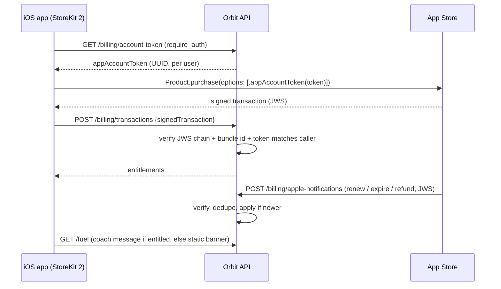

# Spec — Monetization: StoreKit 2 subscriptions ("Orbit Pro")

_Status: **specced, not scheduled** (owner, 2026-09-19). This is not in the roadmap's run
order. It becomes a run only if the owner chooses **freemium** at the roadmap's go-live
gate ([docs/roadmap.md](../roadmap.md)). At that point requirements-elicitation +
planning consume this spec the way they consume a `plans/` brief. Nothing here is
built yet. Until then, every feature (including the C7 coach) ships free to all users._

## Why StoreKit 2, not Stripe
- Apple's App Review Guideline 3.1.1 requires In-App Purchase for digital features
  unlocked inside an iOS app. Orbit's paid features (the adaptive coach first) are
  exactly that.
- Orbit is iOS-only, so Stripe's cross-platform advantage doesn't apply yet. StoreKit is
  a one-tap Face ID purchase with no card form, which converts better at small scale.
- Fees: 15% under Apple's Small Business Program (< $1M/yr proceeds; enrollment
  required), versus Stripe's ~2.9% + 30¢. The difference is small at Orbit's scale;
  the conversion and review-risk difference is not.
- **No payment card data ever reaches Orbit's servers.** PCI DSS scope stays
  effectively nil; regulated-data-conventions' PCI never-store rules are met by
  construction.
- **Stripe stays a documented extension, not a replacement** (see
  [Future: Stripe web checkout](#future-stripe-web-checkout)).

## Product model (defaults; the open decisions below can change them)
- One subscription group, **Orbit Pro**, with two auto-renewable products:
  - `com.orbitfitness.orbit.pro.monthly`
  - `com.orbitfitness.orbit.pro.annual`
- Optional introductory offer (free trial), configured in App Store Connect, not in code.
- **Paid: the C7 adaptive coach.** The free tier keeps C7's static banner (C7 §
  Monetization tie-in).
- **Never paid, whatever else changes:**
  - core food/weight/workout logging
  - account deletion
  - data export (D1)
  - anything required for the user's data rights or safety
- **Products map to entitlements in server config, not code.** `pro` grants
  `{"coach"}`. Moving a feature between tiers is a config change.

## Architecture

### iOS
- **`PurchaseStore`**: an `@Observable` store in `Core/`, per swift-conventions. It:
  - loads products with `Product.products(for:)`
  - purchases with `.appAccountToken(token)`
  - starts a `Transaction.updates` listener at app launch (renewals, Ask to Buy,
    purchases made on another device)
  - forwards every verified transaction to the backend
  - calls `transaction.finish()` only after the backend acknowledges it
- **Restore:** a "Restore Purchases" button (`StoreKit.AppStore.sync()`, then re-post
  `Transaction.currentEntitlements`). It must be module-qualified: the app's own
  `final class AppStore` (`ios/Orbit/Core/AppStore.swift`) shadows StoreKit's.
- **Manage:** `.manageSubscriptionsSheet` for cancel/change.
- **Paywall screen** (undepicted): follows the design README's "Extending the UI"
  conventions. It uses the `Theme` palette (no hardcoded hues), ≥ 44 pt targets and
  VoiceOver labels on price and terms. It must show what App Review Guideline 3.1.2
  requires:
  - title, length and price per period
  - trial terms, if a trial exists
  - links to the privacy policy and Terms of Use (EULA)
- **UI state is a hint only.** The server's entitlement decides access. The client never
  unlocks a feature on its own say-so.

### Backend
- **One billing facade** (`src/orbit/billing/`, per code-standards' facade rule) wraps
  Apple's official **`app-store-server-library`** (PyPI). It exposes `SignedDataVerifier`
  for transactions and notifications, and optionally `AppStoreServerAPIClient` for
  reconciliation. Configuration comes from `Settings`:
  - bundle id, app Apple ID
  - accepted environments
  - Apple root CA certificates (vendored, with checksums recorded)
- **Endpoints.** All follow the standing shapes (401 unauthenticated, cross-owner 404,
  `extra="forbid"`, a rate-limit tier, B1 audit events):
  - `GET /billing/account-token`: returns the caller's `appAccountToken`, creating it on
    first call (a random UUID, not derived from the uid).
  - `POST /billing/transactions`: verifies the signed transaction:
    - Chain to Apple root, bundle id, environment.
    - Requires `appAccountToken` = the caller's token (new purchases).
    - Upserts the entitlement.
    - Returns the caller's entitlements.
  - `POST /billing/restore`: the restore path. The purchase belongs to the Apple ID, not
    the Orbit account. So a verified transaction whose token belongs to a *different*
    Orbit account, **or carries no token**, can be **rebound** to the caller. See the
    open decision on this policy.
    - **A signed transaction is a bearer artifact**, not bound to whoever posts it.
      Without guards, a leaked or shared JWS lets any Orbit user take someone's Pro
      through this endpoint, bypassing the token check on `/billing/transactions`.
    - Rebind only when the JWS is fresh: its `signedDate` is newer than the row's
      `last_signed_date` and recent, as produced right after `AppStore.sync()`.
    - Throttle rebinds per `original_transaction_id` and alert on flip-flopping.
    - On rebind, call the App Store Server API's **Set App Account Token**, so future
      notifications carry the new owner's token.
    - Audit every rebind. The residual risk (a fresh JWS shared deliberately) is
      recorded, not hidden.
    - The same path handles transactions that reach `Transaction.updates` with no token
      or a foreign one: offer codes redeemed in the App Store, purchases made before
      login or on another device.
    - Family Sharing (`ownershipType = FAMILY_SHARED`) is refused unless the Family
      Sharing decision turns it on.
  - `GET /me/entitlements`: active entitlements + expiry + status, for the UI.
  - `POST /billing/apple-notifications`: App Store Server Notifications V2.
    - **No Firebase auth.** Trust comes from JWS verification of `signedPayload`, done
      before any DB write. This is a declared **exception to standing rule 3's
      "unauthenticated → 401"**, so adversarial tests and DAST expect a 4xx for bad
      signatures, not a 401.
    - It must be reachable through the deployed front door. Apple sends plain POSTs, so
      CloudFront → Function URL with OAC (which needs a client-computed body hash) cannot
      front it without Lambda@Edge; see A2.
    - IP-tier rate limit + a small body cap.
    - Always returns 200 once verified (Apple retries non-200s).
    - **Derive state from the signed contents, not the type name.** Read
      `signedTransactionInfo` / `signedRenewalInfo` (`productId`, `expiresDate`,
      `revocationDate`, grace-period expiry) for every notification. The type is used
      for audit and metrics.
    - Types this group will see:
      - `SUBSCRIBED`, `DID_RENEW`, `DID_CHANGE_RENEWAL_STATUS`
      - `DID_CHANGE_RENEWAL_PREF`: an `UPGRADE` subtype switches monthly ↔ annual
        immediately and changes `product_id`
      - `DID_FAIL_TO_RENEW` (with/without grace), `GRACE_PERIOD_EXPIRED`, `EXPIRED`
      - `REFUND`, `REVOKE`, `REFUND_REVERSED`
      - `RENEWAL_EXTENDED` (moves the expiry), `OFFER_REDEEMED`, `PRICE_INCREASE`
      - `TEST` (Apple's "Request a Test Notification")
    - Unknown types are acknowledged and logged, never erroring.
    - **Mark a notification seen only after it is processed successfully.** Inserting
      into `billing_notifications_seen` first would swallow Apple's retry after a
      failed attempt.
- **Guard: two forms, both DB lookups** (bounded, indexed). Neither depends on the
  roadmap's "internal token exchange" item; if that item lands later, entitlements can
  move into its claims.
  - **Soft `has_entitlement(uid, "coach")`** for shared endpoints. `GET /fuel` is the core
    daily food screen and stays free. It picks the adaptive coach message when entitled,
    and C7's static banner otherwise. It **never 403s**.
  - **Hard `require_entitlement("coach")`** (C7's shape) is a FastAPI dependency that
    403s. It applies only to coach-only endpoints, such as goal or adjustment endpoints
    if C7 adds them.
  - Any cache is short-lived and **invalidated on refund, revoke or expiry writes**, so
    a refunded user loses access immediately.
- **Ordering:** Apple does not guarantee notification order. Apply an update only if
  its `signedDate` is newer than the row's `last_signed_date`.
- **Reconciliation (optional, live-only):**
  - An App Store Server API key (`.p8`, in Secrets Manager via `get_secret`) lets a
    `refresh` call Apple's "Get All Subscription Statuses" when a notification may
    have been missed.
  - No scheduled job: refresh lazily on read, matching C7's lazy-compute posture.

### Data (owner-scoped; standing rules 1–3 apply)
| Table | Columns (sketch) | Notes |
|---|---|---|
| `billing_customers` | `owner_uid` PK, `app_account_token` UUID UNIQUE, `created_at` | One row per user who opened the paywall. |
| `entitlements` | `id`, `owner_uid`, `original_transaction_id` UNIQUE, `product_id`, `status` (active / grace / billing_retry / expired / revoked / refunded), `expires_at`, `auto_renew`, `environment`, `last_signed_date`, `updated_at` | Bounded read: per-user, LIMIT 20. |
| `billing_notifications_seen` | `notification_uuid` PK, `received_at` | Idempotency only; no personal data; retention ~30 days (data-lifecycle declaration). |

- **Classification:** purchase history is *personal, not sensitive* (SSE baseline, no
  B2 field encryption). No card data, no raw receipts; JWS payloads are not stored.
- **Erasure (standing rule 1):**
  - `billing_customers` + `entitlements` join the `DELETE /me` cascade
    (`src/orbit/lifecycle/erase.py`) and the owner_uid registry. D1's export includes
    entitlement history.
  - **Deleting an Orbit account does not cancel the Apple subscription.** The deletion
    flow must say so and link to Manage Subscriptions (App Store expectations around
    5.1.1(v)).
  - Notifications that arrive for an erased user's token are acknowledged and dropped,
    never used to recreate rows.
- **Audit (B1):** entitlement granted / changed / revoked, restore rebinds, notification
  verification failures.

## Security (STRIDE highlights for planning's worksheet)
- **Spoofing (forged notifications or transactions):** full JWS chain verification to
  Apple's root CA, plus bundle id and app Apple ID checks.
  - The library's `Xcode`/`LocalTesting` environments **skip chain verification**
    (confirmed in the library source, 2026-09-19): an Xcode-environment verifier accepts
    any well-formed JWS.
  - So the accepted-environments list is config, and **settings validation rejects**
    `Xcode`/`LocalTesting` whenever the configured App Store environment is Production.
    This is a config-consistency check in `Settings`, not a code path that branches on
    the deployment environment (standing rule 4).
- **Tampering (client claims Pro):** the client never asserts an entitlement. Only
  verified Apple-signed data changes the `entitlements` table.
- **Replay:** dedupe on `notificationUUID`; `signedDate` ordering; transactions are
  upserted by `original_transaction_id` (idempotent).
- **Elevation / cross-user:** a new purchase must carry the caller's `appAccountToken`.
  Rebinding happens only through the restore path, which is freshness-checked,
  throttled and audited, and resets the token with Apple. The residual risk (a
  deliberately shared fresh JWS) is accepted and recorded.
- **Sandbox in production:** App Review tests purchases in **sandbox against the
  production backend**. So production must accept `Sandbox` transactions, with the
  environment recorded on the row.
  - The library raises `INVALID_ENVIRONMENT` on a mismatch, so production runs **two
    `SignedDataVerifier`s** (Production and Sandbox) and picks one by the payload's
    environment.
  - **TestFlight also uses the sandbox, with testers' real Apple IDs and free
    purchases.** A public TestFlight link would therefore hand free Pro to anyone
    against production. Mitigations:
    - Keep TestFlight to invited testers.
    - Or grant sandbox entitlements a short expiry cap.
    - Or accept the leak and record it.

    Decide before any public beta.
- **DoS:** notification endpoint IP-throttled with a small body cap; verification
  happens before any DB work.

## Local-first testability (what Phases A–D tooling can prove)
- **iOS, $0, no Developer account:**
  - An Xcode **StoreKit Configuration file** (`.storekit`) in the scheme simulates
    products, purchases, renewals, expiry, refunds and Ask to Buy in the Simulator.
  - **StoreKitTest** (`SKTestSession`) drives the same scenarios in XCTest/XCUITest,
    with accelerated renewal time.
- **Backend:**
  - pytest builds its own test certificate chain and signs fixture transactions and
    notifications, injecting the test root through `Settings`.
  - Simulator end-to-end runs use the library's Xcode environment, configured locally
    only.
- **Live-only (owed to Phase E):**
  - the Paid Applications Agreement, banking and tax forms
  - Small Business Program enrollment
  - products created in App Store Connect
  - sandbox tester purchases
  - real notifications to a deployed URL (needs E1), and Apple's "Request a Test
    Notification"
  - the App Store Server API key
  - reviewer-visible paywall metadata (E3)

## App Store / privacy impact (feeds E3)
- Privacy nutrition label + `PrivacyInfo.xcprivacy`: add **Purchases → Purchase
  History**, linked to the user, for app functionality.
- The greenfield AC32 "IAP: N/A" entry is superseded.
- App Store metadata: subscription display names, descriptions, review screenshot of the
  paywall, Terms of Use link.
- Enable **Billing Grace Period** in App Store Connect; the entitlement stays active
  during grace.

## Dependencies
- Backend: `app-store-server-library` (Apple). It goes through dependency-audit-policy
  at run time: registry reality check, cooldown, exact pin, transitive crypto deps.
- iOS: none (StoreKit is a system framework).

## Open decisions (owner, when the run is scheduled)
1. Which features are Pro beyond the coach (candidates: C5 percentile detail, C8
   cosmetic unlocks)? The "never paid" list above stands regardless.
2. Price points and whether to offer a free trial (e.g. 7 days).
3. Family Sharing on or off (default off).
4. Restore policy for a purchase already bound to another Orbit account: rebind
   (recommended default) or refuse.
5. Early-user grandfathering: do pre-freemium users keep the coach free?
6. Run slot: after C7 at the earliest (it consumes C7's gate). Everything but the
   live-only list can be built locally before go-live.

## Acceptance sketch
- Simulator (StoreKit config): purchase → coach unlocks. Expire, refund, or revoke →
  the coach locks and the static banner returns. Restore on a fresh install re-unlocks.
- Backend:
  - forged and wrong-bundle JWS rejected; Xcode/LocalTesting-signed JWS rejected by
    production settings (sandbox JWS is *accepted*, since App Review needs it)
  - stale or throttled restore rebind refused
  - a duplicate notification is a no-op
  - an out-of-order older notification is ignored
  - cross-user purchase token → rejected
  - restore rebind audited
  - `require_entitlement` 403s on coach-only endpoints without Pro; `GET /fuel` returns
    200 with the static banner without Pro
  - refund notification → access revoked on the next request (cache invalidated)
  - a notification whose processing fails is retried, not deduped away
- `DELETE /me` erases billing rows; the parity test passes; the deletion UI states that
  the Apple subscription continues until cancelled.
- The paywall meets 3.1.2 disclosure; VoiceOver reads price and period.

## Size
Medium: a billing facade, 5 endpoints, 3 tables, a paywall screen and a
`PurchaseStore`; mostly local, with a live-only tail in Phase E (E1 owns the deployed
notification URL, E3 the App Store Connect side).

## Future: Stripe web checkout
If Orbit later adds a web version, or uses the US-storefront external purchase link:
- A Stripe Checkout + webhook path (signing-secret verification, event-id dedupe) writes
  to the **same `entitlements` table**, with a `source` column (`apple` | `stripe`).
- `require_entitlement` stays unchanged.
- Card data still never touches Orbit: Stripe-hosted Checkout keeps PCI at SAQ A.
- Link-out rules differ by storefront; re-check them at that time.
