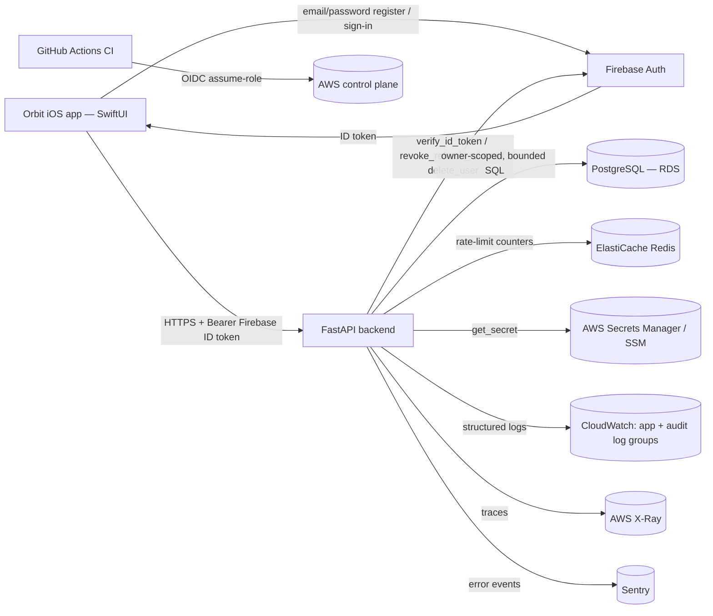
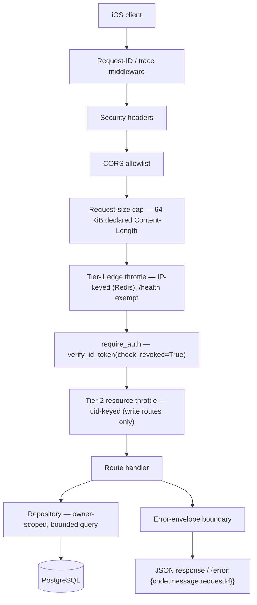
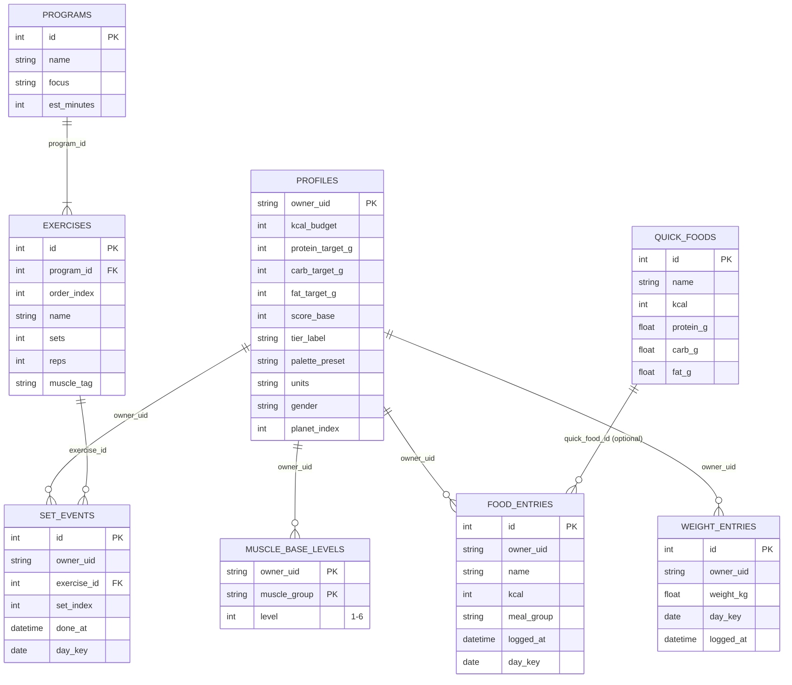
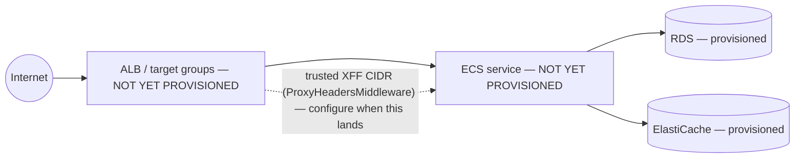

# System architecture — Orbit

> Cross-cutting: how the pieces fit together end-to-end. For what a single directory
> does, see that directory's own README. Regenerate only the diagram a change affects.

This is the **greenfield** architecture: native SwiftUI iOS client → FastAPI backend →
PostgreSQL, fronted by Firebase Auth, on an AWS data-security baseline (compute deferred).
See `.pipeline/plan.md` (retained at `docs/decisions/feature/greenfield/plan.md`) for the
full STRIDE threat model this architecture is held to.

## 1. System context

Firebase owns password storage, KDF, and breach policy — the backend never receives a
raw password, only verifies signed ID tokens. Every domain row in PostgreSQL is scoped by
`owner_uid` (the Firebase UID); no local PII beyond that opaque key (email/display name
stay in Firebase).

## 2. Request lifecycle (edge middleware chain)

Every request passes through the same middleware stack, registered once in
`src/orbit/main.py`:

`GET /health` short-circuits before the Tier-1 throttle touches Redis and before `auth`
— it has no external dependency, by design (the smoke check's own contract). Write
routes (`POST /fuel/entries`, `POST`/`DELETE /train/sets`, `POST /weight`,
`PATCH /profile`, `POST /me/signout`, `DELETE /me`) are the only ones behind Tier-2;
`DELETE /me` additionally requires `require_fresh_reauth` (Firebase `auth_time` within 5
minutes) ahead of the handler.

## 3. Data model

`MUSCLE_LEVEL_TEMPLATES` (a 4th global/seed table, not shown above — same shape as
`MUSCLE_BASE_LEVELS` but with no `owner_uid`) holds the per-user defaults
`POST /me/bootstrap` copies on account creation; it is a judgment-call addition beyond
the plan's literal 9-table list (see `migrations/README.md`). `QUICK_FOODS`,
`PROGRAMS`/`EXERCISES`, and `MUSCLE_LEVEL_TEMPLATES` are global seed/reference data with
no owner; every other table carries `owner_uid` and is scoped + bounded
(`food_entries` ≤200/day, `weight_entries` 30-day window, both hard `LIMIT`s) at the
repository layer.

## 4. Deployment topology

**Current (this run) — direct process, data-security baseline only:**

**Deferred (run 1 — `plans/01-production-deploy-path.md`): the compute path.**
`deploy.yml` already scaffolds the target shape (verify signed image → `terraform apply`
→ migrate → canary rollout by ALB target-group weight, staging before prod, human
approval gate on the `production` environment) — but `infra/` does not yet provision the
ALB, ECS cluster/service, or the `envs/` staging/prod split it targets:

The Tier-1 rate limiter's `ProxyHeadersMiddleware` XFF-trust configuration is a **latent**
item that only activates once an ALB exists (security-report row 30) — deliberately left
unconfigured this run because there is no trusted proxy CIDR yet; configuring it against
no ALB would let any client spoof `X-Forwarded-For` and bypass the throttle.
