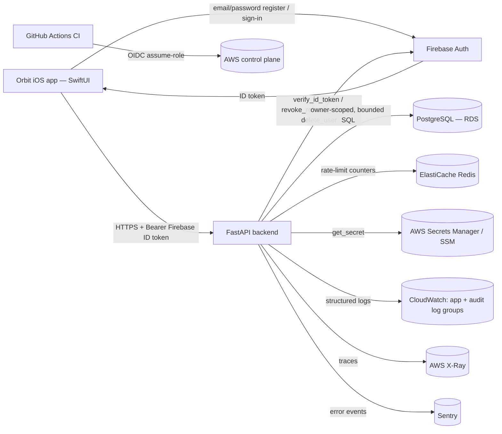
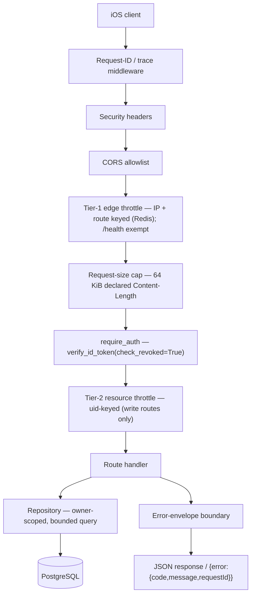
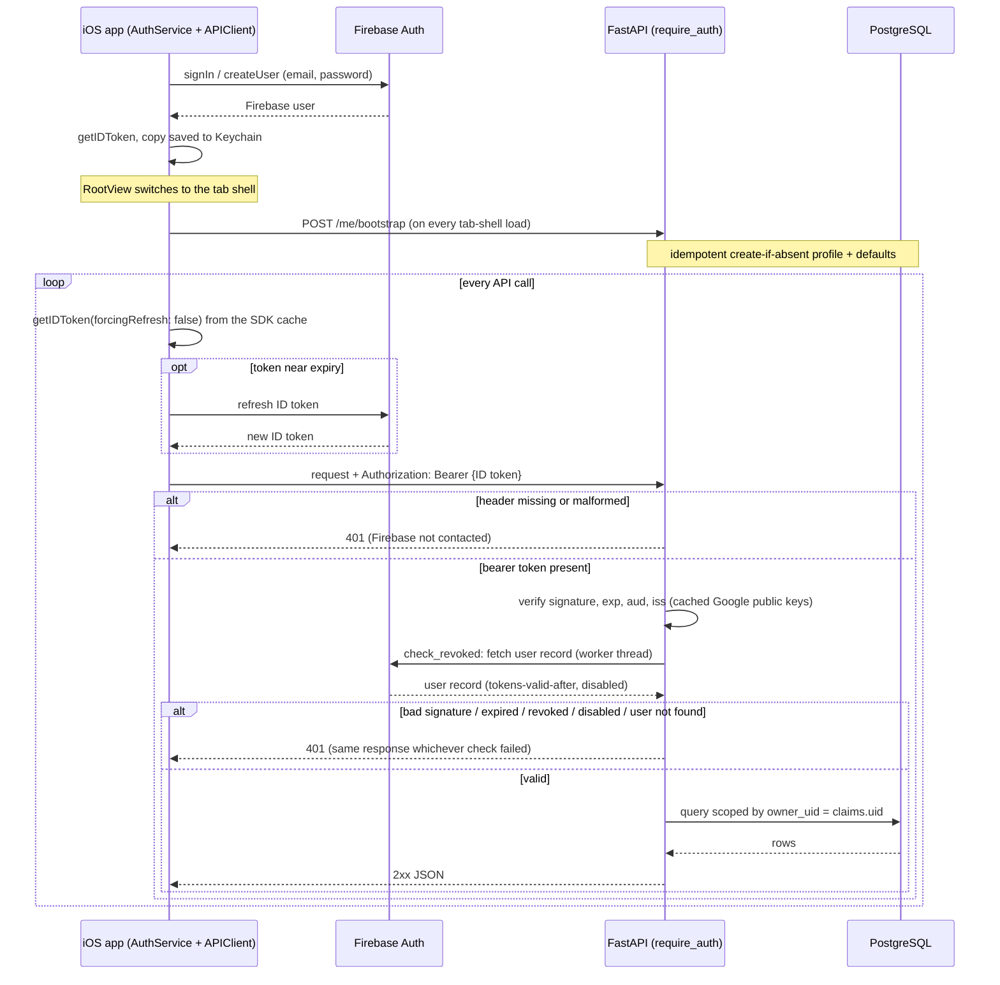
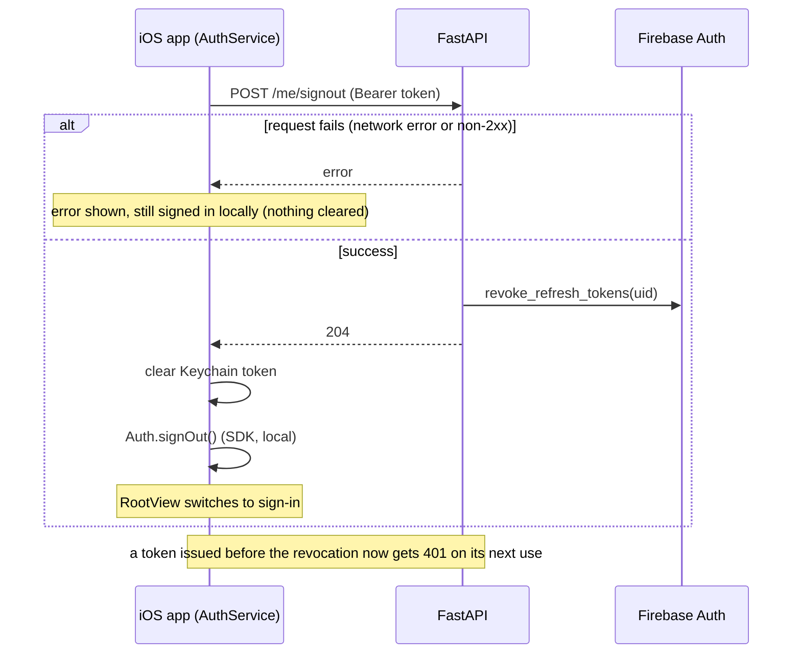
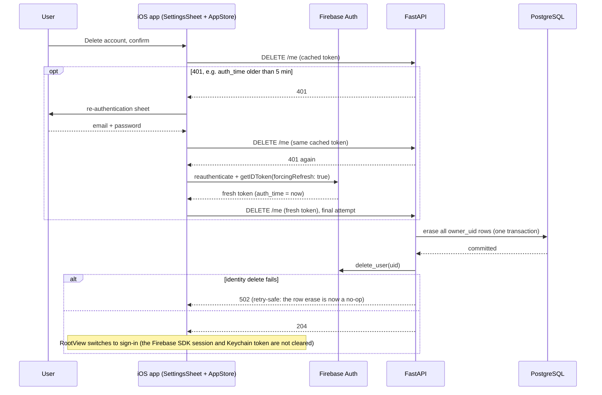
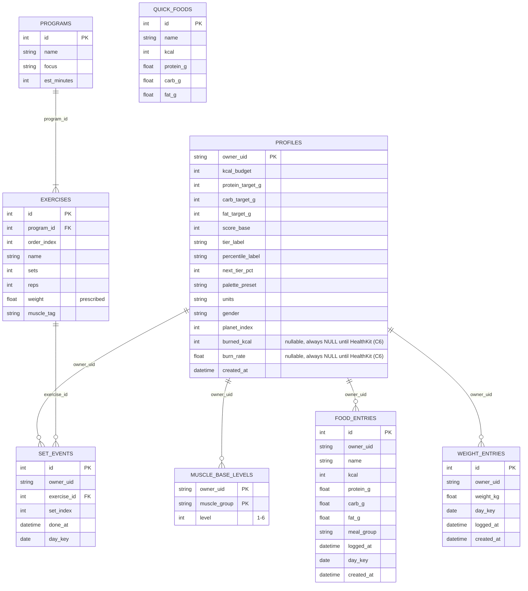
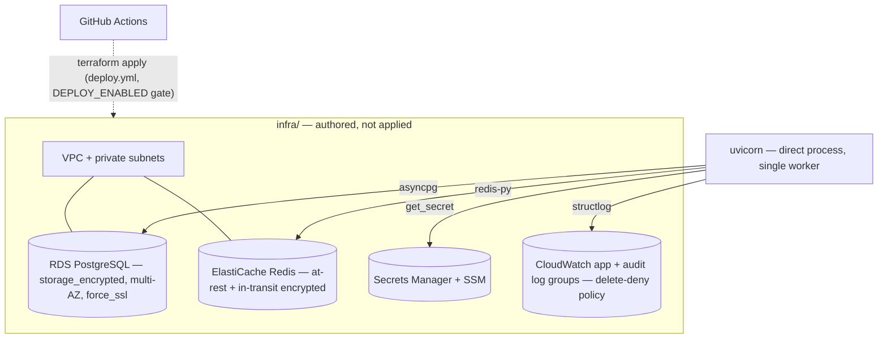
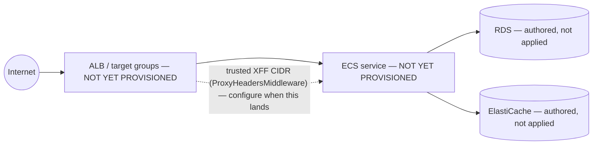

# System architecture — Orbit

> Cross-cutting: how the pieces fit together end-to-end. For what a single directory
> does, see that directory's own README. Regenerate only the diagram a change affects.

This is the **greenfield** architecture: native SwiftUI iOS client → FastAPI backend →
PostgreSQL, fronted by Firebase Auth, on an AWS data-security baseline (compute deferred).
See `docs/decisions/feature/greenfield/plan.md` for the full STRIDE threat model this
architecture is held to.

## 1. System context

Firebase owns password storage, KDF, and breach policy — the backend never receives a
raw password, only verifies signed ID tokens. Every domain row in PostgreSQL is scoped by
`owner_uid` (the Firebase UID); no local PII beyond that opaque key (email/display name
stay in Firebase).

## 2. Request lifecycle (edge middleware chain)

Every request passes through the same middleware stack, registered once in
`src/orbit/main.py`:

The order is `create_app()`'s registration in `main.py` (Starlette runs the last-added
middleware outermost). `GET /health` is exempt from the Tier-1 throttle, so it never touches
Redis, and it never reaches `auth`
— it has no external dependency, by design (the smoke check's own contract). Write
routes (`POST /fuel/entries`, `POST`/`DELETE /train/sets`, `POST /weight`,
`PATCH /profile`, `POST /me/signout`, `DELETE /me`) are the only ones behind Tier-2;
`DELETE /me` additionally requires `require_fresh_reauth` (Firebase `auth_time` within 5
minutes) ahead of the handler.

## 3. Authentication

Firebase Auth owns identity (passwords, accounts, token issuance); the backend only
verifies Firebase ID tokens. On iOS, `Core/AuthService.swift` owns every runtime Firebase
call; the only other file importing `FirebaseAuth` is `App/OrbitApp.swift`, for
DEBUG-only emulator wiring and the UI-test auth reset (both compiled out of Release). On
the backend, `src/orbit/auth/firebase.py` is the only module that imports
`firebase_admin`, behind the `require_auth` / `require_fresh_reauth` facade in
`src/orbit/auth/__init__.py`.

**Sign-in and an authenticated request:**

The signature check is local, but `check_revoked=True` fetches the user record from
Firebase, so every authenticated request makes a round trip to Firebase. `owner_uid` always
comes from the verified claims, never from the request body.

**Sign-out** revokes the token server-side before discarding it locally:

**Account deletion** additionally requires a recent login (`require_fresh_reauth`:
`auth_time` within 5 minutes). Any 401 on the first attempt opens the re-authentication
prompt. `AppStore.deleteAccount` then sends `DELETE /me` again with the old token *before*
re-authenticating, so a stale session makes three calls in total:

## 4. Data model

`MUSCLE_LEVEL_TEMPLATES` (a 4th global/seed table, not shown above — same shape as
`MUSCLE_BASE_LEVELS` but with no `owner_uid`) holds the per-user defaults
`POST /me/bootstrap` copies on account creation; it is a judgment-call addition beyond
the plan's literal table list, and brings the schema to 9 tables (see
`migrations/README.md`). `QUICK_FOODS`,
`PROGRAMS`/`EXERCISES`, and `MUSCLE_LEVEL_TEMPLATES` are global seed/reference data with
no owner; every other table carries `owner_uid` and is scoped + bounded
(`food_entries` ≤200/day, `weight_entries` 30-day window, both hard `LIMIT`s) at the
repository layer.

**`QUICK_FOODS` deliberately has no edge to `FOOD_ENTRIES`.** A quick-add copies the
catalog row's name and macros into the entry at logging time; `food_entries` carries no
`quick_food_id` column and no FK (`repositories/fuel.py`). The persisted entry is a
**snapshot**, so re-pricing or correcting a catalog row never retroactively rewrites what
a user already logged — and an entry survives its catalog row being removed.

## 5. Deployment topology

**Where things stand:** the backend runs as a direct process (`uvicorn`) on the
developer's machine against a local Postgres, a local Redis and the Firebase Auth
emulator, with the iOS Simulator as the client. Development stays local-first until an
explicit go-live decision (`docs/roadmap.md`). The Terraform below is **authored but has
never been applied** to any AWS account (`offline_validate=true`); the diagram shows the
target it describes.

**Authored in `infra/` (never applied) — the data-security baseline:**

**Deferred (authored in A2 — `plans/A2-production-terraform-authoring.md`; applied at
go-live in E1 — `plans/E1-production-deploy-path.md`): the compute path.**
`deploy.yml` already scaffolds the target shape (verify signed image → `terraform apply`
→ migrate → canary rollout by ALB target-group weight, staging before prod, human
approval gate on the `production` environment) — but `infra/` does not yet define the
ALB, ECS cluster/service, or the `envs/` staging/prod split it targets. A1 adds
`envs/local` (LocalStack); A2 authors the rest; E1 applies it:

The Tier-1 rate limiter's `ProxyHeadersMiddleware` XFF-trust configuration is a **latent**
item that only activates once an ALB exists (security-report row 30) — deliberately left
unconfigured this run because there is no trusted proxy CIDR yet; configuring it against
no ALB would let any client spoof `X-Forwarded-For` and bypass the throttle.
